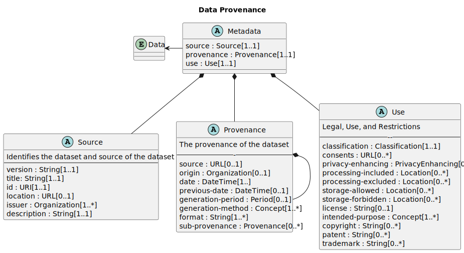

# The Data Provenance Standard

The Data Provenance Standard defines Metadata about a data set, so that the data provenance and lineage is understood. This set of metadata are necessary to enable proper dataset selection for AI Model Training.

**Version 0.1**

**[Published](https://github.com/Data-and-Trust-Alliance/DPS)** Draft

**Authors:**

- [Data and Trust Alliance](https://dataandtrustalliance.org/)
- Kristina Podnar
- John Moehrke

**Comments** inquiries@dataandtrustalliance.org

**License** [Creative Commons Attribution-ShareAlike 4.0 International](https://creativecommons.org/licenses/by-sa/4.0/)

## Abstract

Data transparency is critical. Trust in the insights and decisions coming from both traditional data and AI applications depends on understanding the origin, lineage, and rights associated with the data that feeds them. Lack of transparency has real costs, including unnecessary risks and foregone opportunities. And yet, many organizations today cannot answer basic data questions without considerable difficulty and investment.

To realize the value of data and AI requires a reliable cross-industry baseline of data transparency. Our Data Provenance Standards propose a solution.

## Introduction

For the past quarter century, companies have worked to become “digital.” Now they are using data, algorithms, and AI to reinvent how decisions are made. They are becoming data enterprises. This is transforming everything from retail, education, and entertainment to health and wellness, transportation, and energy.

For these intelligent systems to create economic and societal value for all stakeholders—customers, employees, citizens, shareholders, partners, suppliers, and more—they must be designed and managed responsibly.

The Data Provenance Standards surface metadata on source, legal rights, privacy & protection, generation date, data type, generation method, intended use and restrictions and lineage. Each metadata field has associated values. This essential information about the origin of and rights associated with data allows enterprises to make informed choices about the data they source and use. The result can be improvements in operational efficiency, regulatory compliance, collaboration and value generation.

### The Data & Trust Alliance

The Data & Trust Alliance brings together leading businesses and institutions across multiple industries to learn, develop, and adopt responsible data and AI practices. Established in September 2020, it was founded as a not-for-profit consortium and is co-chaired by Ken Chenault, General Catalyst chairman and managing director, and former American Express chairman and CEO; and Sam Palmisano, former IBM chairman and CEO. Jon Iwata, founding executive director, works with our Leadership Council, a cross-functional team of senior executives selected by their CEOs to identify and drive Alliance projects.

### Normative vs Informative

This specification adopts the normative words defined in IETF [Best Current Practice 14](https://www.rfc-editor.org/info/bcp14): Key words for use in RFCs to Indicate Requirement Levels (BCP-14), certain words indicate whether a specific content is normative. The key words "MUST", "MUST NOT", "REQUIRED", "SHALL", "SHALL NOT", "SHOULD", "SHOULD NOT", "RECOMMENDED", "MAY", and "OPTIONAL" in this document are to be interpreted as described. Informative content does not contain these key words.

### Concepts

The following concepts are used throughout the specification

- **AI**: todo
- **Dataset**: A collection of data.
- **Metadata**: Structured description about a Dataset that enable the understanding of that Dataset.
- **Dataset Identifier**: A unique label identifying the provenance metadata of the current dataset
- **Lineage**: Identifiers or pointers of metadata representing the data which comprise the current dataset
- **Source**: Identifies the origin (person, organization, system, device, etc.) of the current dataset
- **Legal Rights**: Identifies the legal or regulatory framework applicable to the current dataset, along with the required data attributions, associated copyright or trademark, and localization and processing requirements
- **Privacy and Protection**: Identifies any types of sensitive data associated with the current dataset and any privacy enhancing techniques applied
- **Generation Date**: Timestamp marking the creation of the current dataset
- **Data Type**: Identifies the data type contained in the current set, and provides insights into how the data is organized, its potential use cases, and the challenges associated with handling and using it
- **Generation Method**: Identifies how the data was produced (data mining, machine-generated, IoT sensors, etc.)
- **Intended Use and Restrictions**: Identifies the intended use of the data and which downstream audiences should not be allowed access to the current dataset

### Use-Case

## Specification

introduce the general structure without specific details

### Detailed

Use inline examples where possible

## Schema

the detailed schema specification

- canonical - the URL that defines the specification
- element description, cardionality
- required vocabulary
  
The D&TA Data Provenance Standards Working Group is responsible for the ongoing monitoring and periodic review of the terms in the registry. This includes:

• Annual review of all terms to ensure continued relevance
• Soliciting feedback from the community on the usage and applicability of terms
• Making revisions to definitions as needed
• Retiring terms that are no longer relevant or have become obsolete

Management of D&TA’s Data Provenance Standards vocabulary registry is a collaborative and dynamic process. We welcome feedback from the broader community to ensure that the vocabulary remains a valuable and accurate resource for all.

## Security considerations

## Acknowledgements
